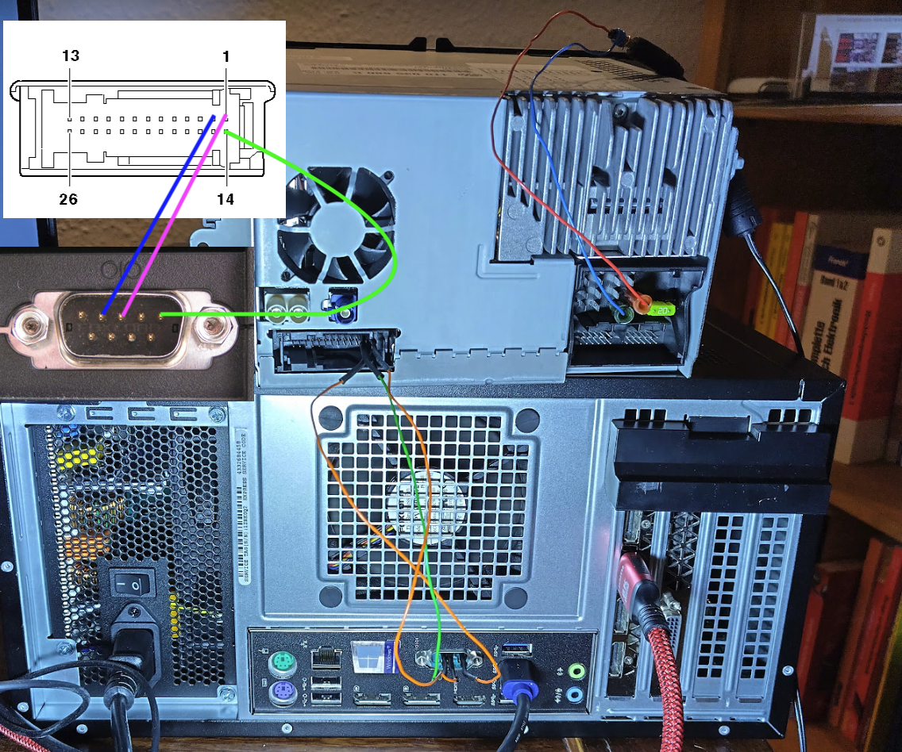

# RNS510 Code Finder

This Python script is designed to communicate with the RNS510 device through a serial port to find the correct PIN code via a brute-force approach.

## Features

- **Serial Communication:** Uses `pyserial` to communicate with the RNS510 device via a COM port.
- **Brute Force Code Finder:** Iteratively tries different PIN codes within a specified range to find the correct one.
- **Pin Verification:** Sends each PIN to the device and checks the response to determine if it is valid.

## Requirements

- Python 3.x
- `pyserial` library

### Hardware 

- 12V Power Supply >1.5A
- COM Cable or dupont pins 

## Installation

1. **Clone the repository:**

   ```bash
   git clone https://github.com/SlashGordon/rns510-code-finder.git
   cd rns510-code-finder
   ```

2. **Install the necessary Python package:**

   ```bash
   pip install pyserial
   ```

## Usage

1. **Connect your RNS510 device** to your computer via a serial port. 

2. **Run the script:**

   ```bash
   python rns510_code_finder.py --portname COM3 --baudrate 9600 --timeout 2 --start 0 --stop 1999
   ```

   Replace `"COM3"` with the appropriate COM port for your device and adjust the `--baudrate`, `--timeout`, `--start`, and `--stop` options as needed.

3. **Script Execution:**

   - The script will iteratively attempt to find the correct PIN code within the specified range.
   - If the correct code is found, it will be displayed in the terminal.

## Example

```bash
$ python rns510_code_finder.py --portname COM1 --baudrate 115200 --timeout 1 --start 0 --stop 1999
2023-08-12 14:23:45,123 - INFO - Opened serial port COM1
2023-08-12 14:23:45,124 - INFO - Trying code: 0000
2023-08-12 14:23:45,225 - INFO - Code 0000 is invalid.
...
2023-08-12 14:24:15,567 - INFO - Trying code: 1234
2023-08-12 14:24:15,668 - INFO - Code found: 1234
2023-08-12 14:24:15,669 - INFO - Closed serial port COM1
```

## Notes

- **Serial Port:** Ensure the correct COM port is specified and that no other programs are using the port.
- **Timeouts:** The script uses a simple timeout mechanism for waiting for responses. You may need to adjust sleep times if the device's response time varies.
- **No GUI:** This script is command-line-based and does not include any graphical user interface.

## Troubleshooting

- **No Response from Device:** If the device is not responding, ensure the correct COM port is being used, the device is properly connected, and the baud rate is correctly set.
- **Port Already in Use:** If you receive an error indicating that the port is in use, ensure no other applications are accessing the COM port.

## License

This project is licensed under the MIT License - see the [LICENSE](LICENSE) file for details.

## Contributing

If you would like to contribute to this project, please fork the repository and submit a pull request. We welcome improvements and bug fixes!
